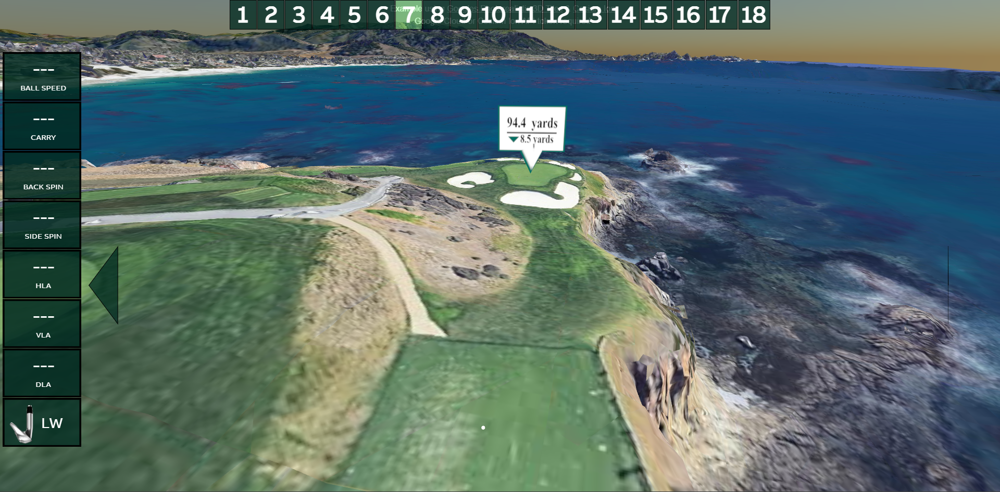
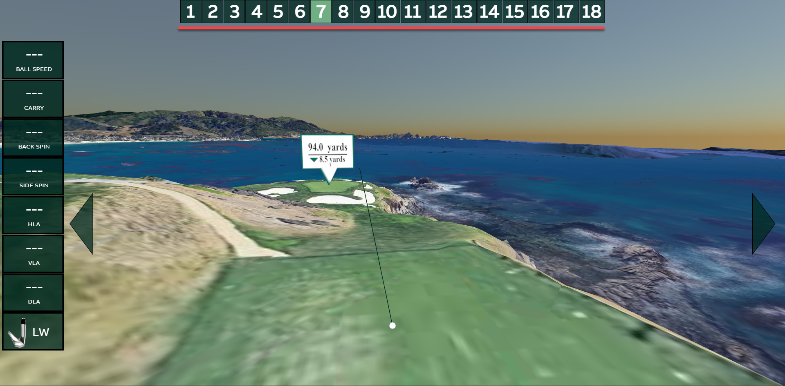

# GoogleEarthGolf
This enables you to golf in Google Earth 3D environment. Every launch monitor which "supports" GSPro connectivity can be connected to this.


# Tools required

## Python
There is a python script which creates a bridge between launch monitors GSPro connector and Google Earth 3D view. It will create a TCP server and it will also host a websocket server so that both launch monitor can connect to "GSPro" and our browser client can read / write shot data.
You can go here to download https://www.python.org/downloads/release/python-3132/ 

## NPM 
This node package manager is used to install all the dependencies and to start hosting the simulator view.
You can go here to download https://nodejs.org/en/download/

## Cesium account - to fetch 3D tiles from Google
Go and make yourself a free account in Cesium: https://cesium.com/learn/ 
Once you have logged in to the website you can enter into ion to see your token (key): https://ion.cesium.com/tokens?page=1
You also need an asset ID for Google Photorealistic 3D Tiles: https://ion.cesium.com/assets/

# Getting started
1. Install required tools
2. Verify your installation from command line

```
C:\Users\jooansk>python --version
Python 3.12.8

C:\Users\jooansk>npm -v
10.9.2

```

3. Install python packages
Go to your project root directory
```
pip install websockets
pip install asyncio
```

4. Fetch node dependencies 
Go to your project root directory
```
node install .
```

5. Run both python script and host vite server (dev/active refresh) from separate terminals
```
C:\Users\jooansk\GoogleEarthGolf>python tcpWs.py


C:\Users\jooansk\GoogleEarthGolf>npm run dev
```

You can of course build the browser project and run then the preview..

```
C:\Users\jooansk\GoogleEarthGolf>npm run build

> GoogleEarthGolf@0.0.0 build
> vite build

vite v6.1.0 building for production...
✓ 117 modules transformed.
dist/index.html                    1.61 kB │ gzip:   0.77 kB
dist/assets/index-CnSJQeG9.js  1,049.80 kB │ gzip: 277.27 kB

C:\Users\jooansk\GoogleEarthGolf>npm run preview

> GoogleEarthGolf@0.0.0 preview
> vite preview

  ➜  Local:   http://localhost:4173/
  ➜  Network: use --host to expose
  ➜  press h + enter to show help
```

# How to use the UI
There are few things that may not be that intuitive but good to know:

First of all if you want to get deeper look how the Google Earth side of things is made possible, here is a link which also provides some good examples and how this could be further improved:
https://github.com/NASA-AMMOS/3DTilesRendererJS?tab=readme-ov-file



1. You can jump to different holes by pressing corresponding number. Also you can relocate yourself to that teebox.

2. There are also two arrows for you to adjust your target line. This will also be adjusted if you left mouse click in the view. Then this mouse click position will be set as the target line.

3. You can reposition yourself to new position by double clicking the view.

4. Right mouse click enables you to rotate around the click position.

5. Mouse scroll will enable you to zoom in and out within certain degree..
